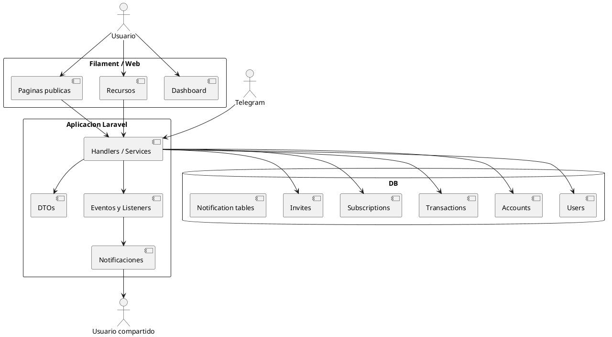

# ABOUT

## Objetivo de este documento

Este documento describe la aplicación actual a partir del código fuente real. La intención es servir como base para rediseñar la interfaz y migrar desde Filament hacia una aplicación web nativa sin cambiar:

- los modelos,
- la base de datos,
- las reglas de negocio,
- los eventos y listeners,
- los procesos automáticos,
- las integraciones de correo, Telegram y OpenAI.

El enfoque de este análisis es funcional: qué existe hoy, cómo se comporta y qué dependencias deben preservarse.

## Resumen ejecutivo

`Simple Finances` es una aplicación de finanzas personales multiusuario con estas capacidades principales:

- gestión de cuentas financieras normales, virtuales y de crédito,
- registro de transacciones de ingreso y egreso,
- soporte para cuentas compartidas entre varios usuarios,
- invitaciones por correo para compartir cuentas,
- reparto de egresos por porcentaje entre usuarios de una cuenta,
- metas financieras por cuenta,
- suscripciones con proyecciones mensual y anual,
- pagos programados de suscripciones y registro opcional del pago como transacción,
- ingresos fijos con ingresos parciales y egresos fijos,
- tablero con widgets de balances, pendientes y proyecciones,
- configuración granular de notificaciones por tipo y por cuenta,
- integración con Telegram para consultar saldo, consultar movimientos, crear, modificar y eliminar transacciones,
- integración con OpenAI para extraer transacciones desde texto, imágenes y audio,
- correos para invitaciones, movimientos en cuentas compartidas y resumen semanal.

## Stack actual

- Backend: Laravel 12
- Panel administrativo / autenticación / recursos: Filament 3
- PHP: 8.2
- Base de datos: compatible con SQLite por defecto; también puede usar otros motores soportados por Laravel
- IA: `openai-php/client`
- Bot: Telegram Bot API
- Correo: notificaciones estándar de Laravel

## Arquitectura funcional actual



## Rutas y secciones visibles hoy

### Rutas principales confirmadas

- `/dashboard`
- `/accounts`
- `/accounts/create`
- `/accounts/{record}`
- `/accounts/{record}/edit`
- `/transactions`
- `/transactions/create`
- `/transactions/{record}/edit`
- `/subscriptions`
- `/subscriptions/create`
- `/subscriptions/{record}/edit`
- `/fixed-incomes`
- `/fixed-incomes/create`
- `/fixed-incomes/{record}`
- `/fixed-incomes/{record}/edit`
- `/account-invites`
- `/notification-setup-page`
- `/profile`
- `/projection`
- `/terms-and-conditions`
- `/privacy-policy`
- `/register`
- `/login`
- `/password-reset/request`
- `/password-reset/reset`
- `/email-verification/prompt`
- `/email-verification/verify/{id}/{hash}`
- `POST /api/telegram-webhook`

### Configuración global del panel Filament

El panel administrativo está montado en `/` y usa:

- login estándar de Filament,
- registro custom con enlaces a términos y política,
- recuperación de contraseña,
- verificación de correo,
- edición de perfil custom,
- notificaciones en base de datos,
- modo oscuro forzado,
- `SimpleFinancesDashboard` como home real,
- menú de usuario con acceso a configuración de notificaciones.

## Autenticación y páginas públicas

### Login

Está habilitado con la página estándar de Filament. No hay una implementación custom en el proyecto.

### Registro

La pantalla de registro usa la vista custom `resources/views/filament/pages/register.blade.php`. Además del formulario estándar de Filament:

- muestra enlace a login si aplica,
- exige aceptación implícita de términos y política al registrarse,
- enlaza a `/terms-and-conditions` y `/privacy-policy`.

### Recuperación de contraseña

Está habilitada con las páginas estándar de Filament:

- solicitud de enlace,
- pantalla de restablecimiento.

### Verificación de correo

Está habilitada con el flujo estándar de Filament/Laravel. El modelo `User` implementa `MustVerifyEmail`.

### Perfil

Ruta: `/profile`

Además de nombre, correo y contraseña, el perfil agrega:

- `phone_number`,
- estado de conexión con Telegram,
- acción `Conectar con Telegram`,
- acción `Desconectar Telegram`.

El flujo de Telegram desde perfil es:

1. el usuario genera un código de 6 dígitos,
2. el código expira en 10 minutos,
3. el usuario envía `/verify {codigo}` al bot,
4. el sistema vincula `telegram_chat_id`,
5. se muestra notificación persistente con instrucciones.

Restricciones actuales:

- no se permite generar código si el usuario ya tiene Telegram vinculado,
- límite de 3 códigos por hora,
- al desvincular, se limpia `telegram_chat_id` e invalida códigos pendientes.

### Términos y condiciones

Ruta: `/terms-and-conditions`

Contenido estático en Blade. Incluye:

- fecha de efectividad 16 de marzo de 2024,
- aceptación de términos,
- descripción general del servicio,
- privacidad,
- limitación de responsabilidad,
- terminación,
- contacto.

### Política de privacidad

Ruta: `/privacy-policy`

Contenido estático en Blade. Incluye:

- fecha de efectividad 16 de marzo de 2024,
- datos recopilados,
- uso de la información,
- protección de datos,
- compartición de información,
- derechos del usuario,
- contacto.

## Dashboard

Ruta: `/dashboard`

La página `SimpleFinancesDashboard` contiene 4 widgets y 3 accesos rápidos.

### Acciones rápidas del dashboard

- ir a suscripciones,
- ir a cuentas,
- ir a transacciones.

### Widget: Balance por cuenta

Clase: `AccountBalancePlot`

Comportamiento:

- grafica una barra por cuenta,
- usa todos los balances visibles por scope del usuario,
- transforma balances con `log1p` para reducir dispersión,
- soporta saldos positivos y negativos,
- dibuja línea horizontal en cero,
- en móvil oculta parte de los ejes.

### Widget: Resumen de cuentas

Clase: `PendingTransactionSum`

Muestra:

- monto total pendiente por pagar del usuario autenticado,
- número de cuentas activas,
- número de cuentas compartidas.

### Widget: Pendientes por cuenta

Clase: `PendingTransactionsByAccount`

Muestra tabla de transacciones pendientes creadas por el usuario autenticado:

- concepto,
- cuenta,
- monto.

Acción por fila:

- marcar pendiente como completada.

Acción de cabecera:

- abrir página general de transacciones.

### Widget: Proyección de suscripciones

Clase: `SubscriptionMonthlyProjection`

Muestra:

- ahorro mensual recomendado,
- ahorro quincenal recomendado,
- gasto anual en suscripciones.

Reglas:

- suscripción mensual: se toma tal cual para mensual y por 12 para anual,
- suscripción anual: se divide entre 12 para mensual y se toma tal cual para anual,
- suscripción diaria: usa `30.4` días para mensual y `365` para anual.

## Dominio y modelo de datos

## Scopes globales relevantes

- `BelongsToSharedUsersScope`: filtra cuentas a aquellas donde el usuario autenticado está en la relación `users`.
- `BelongsToUserScope`: filtra modelos por `user_id = auth()->id()`.
- `BelongsToUserThroughAccount`: filtra transacciones a aquellas cuya cuenta pertenece al usuario vía relación many-to-many.

Esto significa que gran parte de la seguridad de lectura depende de scopes globales y no de queries manuales.

## Modelo `User`

Campos relevantes:

- `name`
- `email`
- `email_verified_at`
- `password`
- `phone_number`
- `telegram_chat_id`

Relaciones:

- `accounts()` many-to-many con `Account` y pivote `percentage`
- `notificationTypes()` many-to-many con `NotificationType` vía `notification_setups`
- `notificableAccounts()` many-to-many con `Account` vía `account_user_notifications`
- `telegramVerificationCodes()` hasMany

Reglas/comportamiento:

- siempre puede acceder al panel (`canAccessPanel(): true`),
- `hasTelegramLinked()` indica si existe `telegram_chat_id`,
- `canReceiveNotification($name)` revisa si el tipo de notificación está activo para el usuario.

## Modelo `Account`

Scope global: solo cuentas compartidas con el usuario autenticado.

Campos relevantes:

- `name`
- `description`
- `color`
- `balance`
- `user_id` propietario principal
- `credit_card`
- `credit_line`
- `cutoff_day`
- `next_cutoff_date`
- `available_credit`
- `spent`
- `feed_account_id`
- `virtual`
- `deleted_at`

Relaciones:

- `users()` many-to-many con pivote `percentage`
- `transactions()`
- `feedAccount()` cuenta de alimentación
- `invites()`
- `seedAccounts()` cuentas hijas que la referencian como cuenta de alimentación
- `financialGoals()`

Tipos funcionales:

- cuenta normal,
- cuenta virtual,
- cuenta de crédito.

Reglas de balance:

- cuenta normal: `balance = ingresos completados - egresos completados`,
- tarjeta de crédito:
  - `spent = ingresos completados - egresos completados`,
  - `available_credit = credit_line - (spent * -1)`,
  - `balance = movimientos completados hasta next_cutoff_date`.

Etiqueta visual para selectores:

- `transfer_balance_label` muestra nombre y balance; en tarjetas muestra crédito disponible.

## Modelo `Transaction`

Scope global: solo transacciones cuyas cuentas estén relacionadas al usuario autenticado.

Campos relevantes:

- `parent_transaction_id`
- `user_id`
- `account_id`
- `financial_goal_id`
- `concept`
- `amount`
- `percentage`
- `type` (`income`, `outcome`)
- `status` (`completed`, `pending`)
- `scheduled_at`

Relaciones:

- `account()`
- `user()`
- `financialGoal()`
- `parentTransaction()`
- `subTransactions()`

Conceptos clave:

- transacción principal,
- subtransacción,
- ingreso pendiente generado por repartir un egreso entre usuarios,
- egreso diferido en tarjeta.

Reglas:

- por defecto `status = completed`,
- al crear manualmente, si no se define `user_id`, se toma `auth()->id()`,
- existen scopes `income`, `outcome`, `completed`, `pending`, `beforeOf`, `beforeOrEqualsTo`.

## Modelo `AccountInvite`

Campos relevantes:

- `email`
- `status`
- `account_id`
- `user_id`
- `percentage`

Eventos de modelo:

- `creating` => `AccountInviteCreatingRequested`
- `created` => `AccountInviteCreated`

Relaciones:

- `account()`
- `unscopedAccount()`
- `user()`
- `unscopedUser()`

Estados:

- `pending`
- `accepted`
- `declined`

## Modelo `FinancialGoal`

Campos relevantes:

- `name`
- `amount`
- `progress`
- `must_completed_at`
- `status`
- `account_id`
- `user_id`

Relaciones:

- `account()`
- `user()`

Comportamiento:

- `getAchievedAmount()` suma ingresos completados ligados a esa meta,
- `getRemainingAmount()` resta acumulado al objetivo.

## Modelo `Subscription`

Scope global: `BelongsToUser`

Campos relevantes:

- `name`
- `amount`
- `frequency_type`
- `frequency_unit`
- `started_at`
- `finished_at`
- `next_payment_date`
- `previous_payment_date`
- `feed_account_id`

Relaciones:

- `payments()`
- `feedAccount()`

Tipos soportados:

- diaria,
- mensual,
- anual.

Comportamiento:

- al guardar, listeners recalculan `next_payment_date` y `previous_payment_date`,
- una suscripción cancelada es aquella con `finished_at` no nulo,
- `getAddFrequency()` genera una expresión como `+ 1 months`.

## Modelo `SubscriptionPayment`

Campos relevantes:

- `subscription_id`
- `amount`
- `status`
- `scheduled_at`
- `user_id`

Estados:

- `pending`
- `paid`

## Modelo `FixedIncome`

Scope global: `BelongsToUser`

Campos:

- `name`
- `frequency`
- `user_id`

Relaciones:

- `partials()`
- `outcomes()`

## Modelo `PartialFixedIncome`

Campos:

- `fixed_income_id`
- `name`
- `amount`
- `user_id`

## Modelo `FixedOutcome`

Campos:

- `fixed_income_id`
- `name`
- `amount`
- `type`
- `user_id`

Tipos:

- `savings`
- `transfer`

## Modelos de notificaciones

### `NotificationType`

Tipos seed actuales:

- Invitación a cuentas compartidas
- Respuesta a invitación en cuentas compartidas
- Movimientos en cuentas compartidas
- Resumen semanal de cuentas compartidas

Tipos activos por default al registrar usuario:

- invitación,
- respuesta a invitación,
- movimientos.

### `NotificationSetup`

Tabla pivote usuario <-> tipo de notificación.

### `AccountUserNotification`

Tabla pivote usuario <-> cuenta notificable.

## Modelos Telegram

### `TelegramVerificationCode`

Campos:

- `user_id`
- `code`
- `expires_at`
- `used_at`

Reglas:

- código único de 6 dígitos,
- válido si no fue usado y no ha expirado,
- creación helper `createForUser()`.

## Modelos de batching de notificaciones compartidas

### `SharedTransactionNotificationBatch`

Campos:

- `user_id`
- `account_id`
- `status`
- `window_started_at`
- `last_activity_at`
- `sent_at`

Estados:

- `pending`
- `processing`
- `sent`

### `SharedTransactionNotificationItem`

Campos:

- `batch_id`
- `transaction_id`
- `modifier_id`
- `action`
- `concept`
- `type`
- `amount`
- `scheduled_at`

Acciones:

- `created`
- `updated`
- `deleted`

## Recursos principales y comportamiento UI actual

## 1. Cuentas

Recurso: `AccountResource`

Rutas:

- listado,
- crear,
- ver detalle,
- editar.

### Formulario de cuenta

Campos:

- nombre,
- color,
- descripción,
- toggle de cuenta virtual,
- toggle de tarjeta de crédito,
- si es tarjeta:
  - línea de crédito,
  - día de corte,
- cuenta de alimentación.

Reglas:

- `credit_line` y `cutoff_day` son obligatorios si `credit_card = true`,
- `feed_account_id` no puede ser la misma cuenta al editar,
- al crear o editar una tarjeta se recalcula `next_cutoff_date`.

Cálculo de `next_cutoff_date` actual:

- si el día actual es menor que `cutoff_day`, usa ese día y luego suma un mes,
- en otro caso usa ese día dentro del mes actual.

### Tabla de cuentas

Columnas:

- color,
- nombre,
- estatus (`Activa` o `Archivada`),
- balance,
- total gastado,
- crédito disponible,
- línea de crédito,
- cuenta de alimentación.

Filtros:

- por nombre de cuenta.

Tabs:

- Físicas,
- Virtuales,
- Archivadas,
- Todas.

Acciones de cabecera:

- comparar cuentas,
- nueva transferencia,
- crear cuenta.

Acciones por fila:

- ver,
- acceso rápido para crear transacción en esa cuenta,
- comparación directa con otra cuenta,
- transferencia directa para recibir,
- transferencia directa para enviar,
- editar,
- archivar,
- restaurar.

### Detalle de cuenta

Muestra:

- datos generales,
- color,
- descripción,
- cuenta de alimentación,
- si es tarjeta:
  - fecha de corte,
  - línea de crédito,
  - balance de corte,
  - total gastado,
  - crédito disponible,
- usuarios compartidos,
- porcentaje asignado por usuario,
- egresos pendientes por usuario.

### Relation manager: Transacciones

Características:

- tabla de transacciones dentro de la cuenta,
- agrupación por fecha, usuario y meta financiera,
- filtro por tipo,
- filtro por estatus,
- filtro por rango de fechas,
- filtro por usuario creador.

En tarjetas de crédito agrega tabs:

- Hasta hoy: realmente filtra hasta `next_cutoff_date`,
- Todas.

Formulario:

- tipo,
- estatus,
- concepto,
- monto,
- división entre usuarios,
- `user_payments` cuando aplica,
- fecha,
- meta financiera.

Reglas de división:

- solo visible en egresos,
- solo visible si la cuenta tiene más de un usuario,
- la suma de porcentajes debe ser exactamente `100.00`.

Acciones de cabecera:

- `Crear Egreso Diferido` si la cuenta es de crédito,
- crear transacción normal.

Acciones por fila:

- marcar pendiente como completada,
- editar,
- eliminar.

Acciones masivas:

- exportar seleccionados,
- eliminar seleccionados.

#### Egreso diferido (`DeferredTransactionAction`)

Solo disponible en cuentas de crédito.

Campos:

- concepto,
- monto total,
- fecha,
- número de pagos,
- esquema editable de pagos.

Reglas:

- genera varias transacciones `outcome` con `status = pending`,
- usa `cutoff_day` de la cuenta para calcular fechas,
- ajusta el último pago para compensar diferencias por redondeo,
- dispara `BulkTransactionSaved`.

### Relation manager: Invitaciones

Solo visible si el usuario autenticado es propietario principal de la cuenta (`ownerRecord->user_id === auth()->id()`).

Formulario:

- correo electrónico invitado,
- porcentaje asignado.

Tabla:

- correo,
- estatus.

Acciones:

- crear invitación,
- reenviar invitación si no fue aceptada,
- cancelar invitación si no fue aceptada,
- dejar de compartir si ya fue aceptada.

`Dejar de compartir`:

- elimina relación `account_user`,
- elimina el registro de invitación,
- no elimina transacciones existentes.

### Relation manager: Metas financieras

Formulario:

- nombre,
- cantidad objetivo,
- fecha límite.

Tabla:

- usuario,
- nombre,
- objetivo,
- acumulado,
- restante,
- progreso,
- fecha límite.

Acciones:

- crear,
- editar,
- eliminar.

Al eliminar:

- primero pone `financial_goal_id = null` en transacciones ligadas.

### Relation manager: Usuarios

Tabla:

- nombre,
- porcentaje de egresos.

El porcentaje:

- se edita inline,
- solo puede editarlo el propietario principal,
- dispara `refreshAccount`.

## 2. Transacciones

Recurso: `TransactionResource`

### Formulario

Campos:

- tipo,
- estatus,
- concepto,
- cantidad,
- cuenta,
- dividir entre usuarios,
- arreglo `user_payments`,
- fecha,
- meta financiera.

Reglas:

- `status` se oculta si el tipo no es ingreso,
- la meta financiera se deshabilita para egresos,
- la meta financiera depende de la cuenta seleccionada y del usuario autenticado,
- división entre usuarios replica los porcentajes guardados en el pivote `account_user`.

### Tabla

Columnas:

- concepto,
- cantidad con sumarios de ingresos y egresos,
- tipo,
- estatus,
- cuenta,
- fecha,
- creado por,
- meta financiera.

Agrupaciones:

- cuenta,
- fecha,
- meta financiera.

Filtros:

- cuenta,
- tipo,
- estatus,
- rango de fechas,
- creador.

Tabs:

- Hasta hoy,
- Todas.

Acciones de cabecera:

- nueva transferencia,
- `MSI` global,
- crear transacción.

Acciones por fila:

- marcar pendiente como completada,
- editar,
- eliminar.

Acciones masivas:

- exportar seleccionados,
- eliminar seleccionados.

#### `MSI` global (`GlobalDeferredTransactionAction`)

Disponible desde listado general.

Campos:

- cuenta de crédito,
- concepto,
- monto total,
- fecha,
- número de pagos,
- esquema de pagos.

Reglas:

- solo lista cuentas con `credit_card = true`,
- valida que la suma del esquema sea igual al monto total,
- crea múltiples egresos `pending`,
- dispara `BulkTransactionSaved`.

### Exportación

`TransactionExporter` exporta:

- id,
- concepto,
- cantidad,
- tipo,
- estatus,
- fecha,
- cuenta,
- creado por.

## 3. Suscripciones

Recurso: `SubscriptionResource`

### Formulario

Campos:

- nombre,
- cantidad,
- fecha de contratación,
- frecuencia:
  - cada,
  - unidad,
- fecha de cancelación,
- cuenta de alimentación.

### Tabla

Columnas:

- nombre,
- cantidad,
- siguiente pago,
- pago anterior,
- fecha de contratación,
- frecuencia cada,
- frecuencia unidad,
- fecha de cancelación,
- cuenta de alimentación.

Filtros:

- rango de fechas sobre `next_payment_date`,
- frecuencia.

Tabs:

- Activas,
- Todas,
- Canceladas.

Acciones de cabecera:

- grupo de acciones para proyección mensual y anual,
- importar CSV,
- crear suscripción.

Acciones por fila:

- editar,
- eliminar.

### Widget de cabecera

`RecommendedSaving`

Pretende mostrar:

- ahorro mensual recomendado,
- ahorro quincenal recomendado.

Nota importante:

- la implementación actual usa campos `pricing` y `periodicity_every`, que no existen en el modelo ni en la base actual; esto parece un remanente o bug y debe revisarse antes de replicarlo.

### Relation manager: Esquema de pagos

Tabs:

- Pendiente,
- Pagados,
- Todos.

Columnas:

- fecha de pago,
- cantidad,
- estatus.

Acciones de cabecera:

- generar pagos.

Formulario de generación:

- desde,
- hasta.

Comportamiento:

- regenera pagos dentro del rango,
- borra pagos futuros pendientes previos,
- si la suscripción no tiene pagos, usa `started_at` como inicio por defecto,
- si ya tiene pagos, usa la fecha actual,
- actualiza `next_payment_date`.

Acciones por pago:

- `Pagar`
- `Restablecer`
- eliminar

#### Acción `Pagar`

Efectos:

- marca el pago como `paid`,
- recalcula `next_payment_date` y `previous_payment_date`,
- opcionalmente crea una transacción de egreso en la cuenta elegida.

La transacción creada usa:

- concepto `Pago de subscripción "Nombre" - $Monto`,
- tipo `outcome`,
- estatus `completed`,
- fecha actual.

#### Acción `Restablecer`

Efectos:

- cambia `paid` a `pending`,
- recalcula `next_payment_date` y `previous_payment_date`.

### Página de proyección

Ruta: `/projection?type=monthly|yearly`

Construye una lista de suscripciones activas y calcula una proyección:

- mensual,
- anual.

El total se suma al final.

## 4. Invitaciones

Recurso: `AccountInviteResource`

Está orientado al usuario invitado, no al propietario.

Query base:

- solo invitaciones cuyo `email` coincide con el correo del usuario autenticado,
- solo estatus `pending`.

Tabla:

- cuenta,
- invitación de,
- porcentaje asignado,
- estatus,
- fecha de invitación.

Acciones:

- aceptar,
- declinar.

Comportamiento esperado funcional:

- aceptar debería agregar al usuario a la cuenta compartida,
- declinar debería solo rechazar.

Comportamiento real actual a preservar o corregir con criterio:

- `App\Services\AccountInvites\Respond` siempre ejecuta `attach()` del usuario autenticado a la cuenta, incluso cuando el estado enviado es `Declined`.
- eso significa que hoy el flujo de declinar también puede terminar compartiendo la cuenta.

Ese punto debe considerarse una anomalía actual del sistema.

## 5. Ingresos fijos

Recurso: `FixedIncomeResource`

### Formulario

- nombre,
- frecuencia (`monthly` o `semi_monthly`).

### Tabla

- nombre,
- frecuencia.

### Vista detalle

Muestra:

- nombre,
- frecuencia,
- balance calculado como `sum(partials.amount) - sum(outcomes.amount)`.

### Relation manager: Ingresos parciales

Formulario:

- nombre,
- monto.

Tabla:

- nombre,
- monto.

Acciones:

- crear,
- editar,
- eliminar.

Cada cambio dispara `refreshFixedIncome`.

### Relation manager: Egresos fijos

Formulario:

- nombre,
- monto,
- tipo (`Ahorros` o `Transferencia`).

Tabla:

- nombre,
- monto,
- tipo.

Acciones:

- crear,
- editar,
- eliminar.

También dispara `refreshFixedIncome`.

## 6. Configuración de notificaciones

Página: `NotificationSetupPage`

No aparece en navegación lateral; se accede desde el menú del usuario.

Se divide en dos bloques:

### Tipos de notificación

Lista todas las filas de `notification_types`.

Cada opción funciona como toggle:

- si está activa, al hacer click se hace `detach`,
- si está inactiva, al hacer click se hace `attach`.

### Notificación por cuentas

Lista las cuentas visibles para el usuario y permite activar/desactivar si esa cuenta debe generar correos para ese usuario.

La información de ambas listas se arma con:

- `NotificationSetupBuilder`,
- `NotificableAccountSetupBuilder`.

## Acciones custom de Filament

## Comparación de cuentas

### `CompareAction`

Acción global en listado de cuentas.

Permite seleccionar:

- cuenta origen,
- cuenta destino.

Muestra:

- balance de origen,
- balance de destino,
- diferencia absoluta.

No crea registros; es una herramienta comparativa.

### `DirectCompareAction`

Acción por fila en cuentas.

Prellena:

- origen = cuenta actual,
- destino = `feed_account_id` si existe.

## Transferencias

### `CreateTransferAction`

Acción global.

Campos:

- origen,
- destino,
- monto,
- concepto opcional,
- fecha.

Reglas:

- origen y destino no pueden ser iguales,
- el balance del origen debe ser suficiente.

Comportamiento:

- crea un ingreso en destino,
- crea un egreso en origen,
- ambos `completed`,
- ambos con mismo concepto,
- dispara `BulkTransactionSaved`.

### `DirectReceiveTransferAction`

Acción por fila.

Destino fijo = cuenta actual.

### `DirectSendTransferAction`

Acción por fila.

Origen fijo = cuenta actual.

## Creación rápida de transacción

### `AddTransactionShortcutAction`

Acción por fila en cuentas.

Abre modal para crear transacción directamente sobre la cuenta actual.

No incluye meta financiera.

## Servicios y orquestación de negocio

## Creación y edición de cuentas

### `AccountCreator`

Responsabilidades:

- crear cuenta,
- fijar `user_id`,
- adjuntar al usuario autenticado en pivote `account_user`,
- actualizar balance si es tarjeta,
- activar notificaciones por cuenta.

Nota:

- llama dos veces a `UpdateCreditCardBalance`; hoy esa duplicidad existe.

### `AccountEditor`

- actualiza datos,
- recalcula balance de tarjeta si aplica.

## Transacciones

### `TransactionCreator`

Reglas:

- si el tipo es ingreso, el estatus debe ser `completed`,
- si no hay reparto entre usuarios, crea una sola transacción,
- si hay reparto:
  - crea una transacción principal `outcome`,
  - crea una subtransacción `income` `pending` por usuario,
  - cada subtransacción guarda `percentage`,
  - el monto se calcula proporcionalmente.

### `TransactionUpdater`

Responsabilidades:

- actualizar datos base,
- manejar cambio de tipo,
- crear subtransacciones si antes no existían,
- rebalancear subtransacciones si cambia el monto,
- eliminar subtransacciones `pending` si deja de aplicar el reparto.

Regla importante:

- si cambia de `outcome` a otro tipo, elimina pendientes hijas y desacopla hijas completadas.

### `TransactionRemover`

- elimina subtransacciones pendientes,
- desacopla subtransacciones completadas,
- elimina transacción principal,
- dispara `TransactionSaved` con acción `Deleted`.

### `LastTransactionService`

Usado por Telegram.

Permite:

- obtener la última transacción creada por el usuario,
- validar si puede modificarla,
- validar si puede eliminarla,
- modificar campos puntuales,
- eliminarla.

Regla central:

- el usuario solo puede modificar o eliminar transacciones propias.

## Cuentas y consultas

### `AccountFinderService`

Busca cuentas del usuario por varias estrategias:

1. exacta,
2. case-insensitive,
3. parcial,
4. soundex,
5. similitud de texto.

Es pieza clave para Telegram y OpenAI.

### `AccountBalanceService`

Entrega balance de una cuenta o de todas las cuentas, incluyendo datos extra para tarjetas.

### `TransactionHistoryService`

Entrega:

- movimientos recientes por cuenta,
- movimientos recientes globales,
- resumen estadístico de una cuenta.

## Invitaciones

### `Respond`

Actualiza estatus de invitación y realiza side effects.

Efectos actuales:

- actualiza `status`,
- hace `attach` del usuario autenticado a la cuenta con el porcentaje de la invitación,
- notifica al dueño sobre la interacción,
- habilita notificaciones por cuenta para el usuario invitado solo si la invitación quedó aceptada.

Importante:

- el `attach` ocurre incluso con rechazo; esto parece bug.

### `NotifyOnInteract`

Envía correo al dueño si:

- tiene activo el tipo `INVITATION_INTERACTION`,
- esa cuenta está marcada como notificable para él.

## Suscripciones

### `GenerateSubscriptionPaymentSchema`

Genera filas de `subscription_payments`.

Reglas:

- borra pagos futuros pendientes previos,
- borra pagos dentro del rango pedido,
- no genera nada si la suscripción está finalizada,
- marca como `paid` los pagos históricos y como `pending` los futuros.

### `Subscriptions\UpdateNextPayment`

Actualiza `next_payment_date` para suscripciones no finalizadas.

Implementación actual:

- soporta anual,
- soporta mensual,
- diaria está marcada como no soportada en este servicio.

### `Subscriptions\DailyUpdater`

- recorre todas las suscripciones sin scope,
- llama a `UpdateNextPayment`.

### `SubscriptionUpdater`

Servicio alterno legado para recalcular `previous_payment_date` y `next_payment_date` cuando están vacíos o desactualizados.

## Cuentas de crédito y automatizaciones

### `AutomatedAccountUpdater`

Job programado diario.

Responsabilidades:

- revisar tarjetas de crédito,
- si `now() > next_cutoff_date`, avanzar un mes el corte,
- recalcular balance.

## Resumen semanal

### `AccountSummaryCreator`

Genera CSV temporal por cuenta con:

- concepto,
- monto,
- tipo,
- usuario,
- fecha.

### `WeeklySummaryProcessor`

Cada domingo:

- busca usuarios con notificación `WEEKLY_SUMMARY`,
- filtra cuentas notificables,
- genera adjuntos CSV por cuenta,
- envía correo,
- elimina archivos temporales.

## Notificaciones de cuentas compartidas

### `NotifyOnSharedAccountSaved`

Escucha `TransactionSaved`.

Si la cuenta tiene más de un usuario:

- identifica al modificador,
- para cada usuario distinto del modificador:
  - verifica que tenga activa la notificación de movimientos,
  - verifica que esa cuenta sea notificable,
  - si `notifications.shared_transactions.mode = immediate`, manda correo inmediato,
  - si `mode = grouped`, registra un item para batching.

### `RegisterSharedTransactionNotificationAction`

- abre o reutiliza un batch pendiente por usuario y cuenta,
- crea item con acción, concepto, tipo, monto y fecha,
- actualiza `last_activity_at`.

### `ProcessSharedTransactionNotificationBatchesAction`

Ejecuta cada minuto.

Si el modo es `grouped`:

- toma batches pendientes cuyo `last_activity_at` ya rebasó el debounce,
- los marca como `processing`,
- valida preferencias del usuario,
- envía un correo resumen,
- marca `sent`.

Configuración:

- `SHARED_TRANSACTIONS_NOTIFICATION_MODE=immediate|grouped`
- `SHARED_TRANSACTIONS_NOTIFICATION_DEBOUNCE_MINUTES`

## Eventos y listeners a preservar

## Eventos disparados por modelos o servicios

- `AccountInviteCreatingRequested`
- `AccountInviteCreated`
- `SubscriptionSaving`
- `SubscriptionSaved`
- `TransactionSaved`
- `BulkTransactionSaved`

Nota:

- Laravel 12 puede descubrir listeners automáticamente; no existe un `EventServiceProvider` propio en el proyecto.

## Listeners existentes

### Invitaciones

- `BeforeAccountInviteCreated`: asigna `user_id` al creador autenticado.
- `NotifyOnAccountInviteCreated`: envía correo de invitación.

### Suscripciones

- `BeforeSubscriptionSaved`: calcula `next_payment_date` y `previous_payment_date`.
- `UpdatePaymentSchema`: genera esquema de pagos hasta fin de año.

### Transacciones

- `UpdateAccountOnTransactionSaved`: recalcula balance de la cuenta afectada.
- `UpdateFinancialGoalsOnTransactionSaved`: recalcula `progress` de metas del usuario autenticado en la cuenta.
- `NotifyOnSharedAccountSaved`: notificaciones por cuentas compartidas.
- `UpdateSubTransactionsOnTranactionSaved`: existe, pero está vacío.

### Transacciones en bloque

- `UpdateAccountsOnBulkTransactionSaved`: recalcula cada cuenta afectada una sola vez.

### Registro de usuario

- `AfterUserCreated`: habilita notificaciones default al registrarse.

## Correos y notificaciones existentes

- correo de invitación a cuenta compartida,
- correo de respuesta a invitación,
- correo por movimiento inmediato en cuenta compartida,
- correo por lote de movimientos en cuenta compartida,
- correo con resumen semanal y adjuntos CSV.

Contenido actual de correos:

- usa markdown mail de Laravel,
- enlaza de vuelta a recursos/páginas de Filament,
- en correos de movimientos recalcula y muestra el balance posterior de la cuenta.

## Integración con Telegram

## Entrada

Ruta:

- `POST /api/telegram-webhook`

No exige CSRF.

## Procesamiento general

`TelegramMessageProcessingService`:

- obtiene `chat.id`,
- resuelve procesador por tipo de mensaje,
- procesa,
- responde con `sendMessage`.

## Tipos de mensaje soportados

### `/start`

Muestra instrucciones para vincular la cuenta con un código de 6 dígitos.

### `/verify 123456`

Valida código y vincula `telegram_chat_id`.

### Texto libre

Requiere usuario autenticado en Telegram.

Usa detección de intención para:

- crear transacción,
- consultar saldo,
- consultar movimientos recientes,
- modificar última transacción,
- eliminar última transacción.

### Foto sin caption

- requiere usuario autenticado,
- descarga temporalmente,
- manda a `TransactionProcessorService::processImage()`.

### Foto con caption

- primero intenta detectar intención desde el caption,
- si la intención es crear transacción o no hay procesador adecuado, usa imagen + caption para extraer transacción,
- si detecta otra acción válida, la procesa como comando funcional.

### Nota de voz

- requiere autenticación,
- máximo 60 segundos,
- transcribe con OpenAI,
- detecta intención,
- ejecuta acción.

### Audio

- requiere autenticación,
- máximo 10 minutos,
- máximo 20 MB,
- transcribe con OpenAI,
- detecta intención,
- ejecuta acción.

### Video

- no crea transacciones,
- opcionalmente descarga/guarda si el tamaño lo permite.

### Documento

- no crea transacciones,
- opcionalmente descarga/guarda si el tamaño lo permite.

### Descarga explícita de media

Si el mensaje incluye media y el texto contiene `descargar`, `MediaFileDownloadProcessor` prioriza la descarga y guardado del archivo.

## Acciones funcionales de Telegram

### Consultar saldo

Si no se especifica cuenta:

- devuelve todas las cuentas.

Si la cuenta es tarjeta:

- balance actual,
- crédito disponible,
- total gastado,
- próximo corte.

### Consultar movimientos

Si no se especifica cuenta:

- devuelve últimos movimientos globales.

Si se especifica:

- devuelve últimos movimientos de esa cuenta.

### Crear transacción

Usa texto original y pasa por OpenAI para extraer:

- cuenta,
- monto,
- tipo,
- concepto,
- fecha,
- meta financiera.

Luego valida:

- cuenta existente,
- meta válida para esa cuenta,
- monto positivo,
- fecha parseable.

### Modificar última transacción

Solo sobre la última transacción creada por el usuario.

Puede cambiar:

- concepto,
- monto,
- tipo,
- fecha,
- cuenta.

### Eliminar última transacción

Solo sobre la última transacción creada por el usuario.

## Integración con OpenAI

Servicios:

- `OpenAIService`
- `DummyOpenAIService`

Selección:

- si no hay `OPENAI_API_TOKEN`, se usa dummy.

Capacidades:

- extracción de transacciones desde texto,
- extracción desde imagen,
- transcripción de audio,
- procesamiento de audio,
- detección de intención para Telegram.

Prompts incluidos:

- `MessageActionDetectionPrompt`
- `TransactionExtractionPrompt`

## Jobs programados

Definidos en `routes/console.php`.

- `00:01` diario: actualizar cuentas de crédito (`AutomatedAccountUpdater`)
- `00:30` diario: actualizar siguiente pago de suscripciones (`DailyUpdater`)
- domingo `08:00`: enviar resumen semanal (`WeeklySummaryProcessor`)
- cada minuto: procesar lotes agrupados de movimientos compartidos (`ProcessSharedTransactionNotificationBatchesAction`)

## Base de datos actual

## Tablas de negocio principales

- `users`
- `accounts`
- `transactions`
- `subscriptions`
- `subscription_payments`
- `financial_goals`
- `account_user`
- `account_invites`
- `notification_types`
- `notification_setups`
- `account_user_notifications`
- `telegram_verification_codes`
- `fixed_incomes`
- `partial_fixed_incomes`
- `fixed_outcomes`
- `shared_transaction_notification_batches`
- `shared_transaction_notification_items`

## Tablas de soporte

- `notifications`
- `imports`
- `exports`
- `failed_import_rows`
- `jobs`
- `job_batches`
- `failed_jobs`
- `cache`
- `cache_locks`
- `sessions`

## Reglas funcionales transversales que deben conservarse en la migración

- todas las lecturas de cuentas y transacciones están filtradas por usuario usando scopes globales,
- la cuenta puede estar compartida con varios usuarios,
- el propietario principal es `accounts.user_id`,
- cada usuario puede editar/eliminar solo sus transacciones,
- las cuentas compartidas reparten egresos por porcentaje,
- los repartos generan subtransacciones `income` en `pending`,
- las tarjetas manejan línea de crédito, corte, balance de corte, total gastado y crédito disponible,
- las transferencias crean dos transacciones opuestas,
- las metas financieras viven dentro de una cuenta y dependen del usuario,
- las suscripciones tienen esquema de pagos y cálculo de siguiente/anterior pago,
- las notificaciones son doblemente configurables:
  - por tipo,
  - por cuenta,
- Telegram depende de vinculación previa del usuario,
- OpenAI puede estar ausente y existir modo dummy.

## Dependencias de UX que hoy provienen de Filament y deben reinterpretarse en UI nativa

- tablas con filtros, agrupaciones y tabs,
- formularios reactivos con campos ocultos/mostrados según estado,
- acciones por fila,
- acciones masivas,
- relation managers incrustados en detalle de recursos,
- notificaciones toast,
- widgets del dashboard,
- páginas de autenticación,
- página de perfil,
- páginas simples de términos y privacidad,
- importación y exportación.

## Hallazgos y anomalías del comportamiento actual

Estos puntos forman parte del estado actual del código. Al migrar, conviene decidir explícitamente si se preservan tal cual o si se corrigen.

- `Respond` adjunta al usuario a la cuenta incluso cuando declina la invitación.
- `RecommendedSaving` usa propiedades no existentes (`pricing`, `periodicity_every`).
- `TransactionsRelationManager` en la acción de editar manda `splitBetweenUsers: $data['concept']`, lo que parece un bug.
- `UpdateSubTransactionsOnTranactionSaved` existe pero no implementa lógica.
- `UpdateFinancialGoalsOnTransactionSaved` depende de `auth()->id()`, por lo que fuera de contexto web puede comportarse distinto.
- existe lógica duplicada para recalcular balances y fechas en varias capas.

## Recomendación para pedir maquetas

Si se van a pedir maquetas web nativas, las secciones mínimas a diseñar son:

- login,
- registro,
- verificación de correo,
- recuperación de contraseña,
- dashboard,
- listado de cuentas,
- crear cuenta,
- detalle de cuenta,
- editar cuenta,
- transacciones embebidas por cuenta,
- metas financieras,
- gestión de usuarios compartidos,
- invitaciones enviadas y recibidas,
- listado de transacciones,
- crear/editar transacción,
- flujo de transferencia,
- flujo MSI / egreso diferido,
- listado de suscripciones,
- crear/editar suscripción,
- detalle o módulo de pagos de suscripción,
- proyección mensual,
- proyección anual,
- ingresos fijos,
- detalle de ingreso fijo con parciales y egresos,
- perfil,
- configuración de notificaciones,
- términos y condiciones,
- política de privacidad.

## Criterio final

La aplicación actual no es solamente un CRUD de cuentas y movimientos. Su comportamiento real depende de:

- scopes globales,
- acciones de Filament,
- relation managers,
- servicios de orquestación,
- listeners descubiertos por Laravel,
- jobs programados,
- correo,
- Telegram,
- OpenAI.

Si la migración a UI nativa quiere conservar la misma aplicación y no solo la misma base de datos, estos flujos deben considerarse parte del producto actual.

## Factory de escenarios para Tinker

El proyecto incluye una factory de escenarios orientada a Tinker para generar cuentas, usuarios relacionados e historiales de transacciones con datos coherentes.

Clase principal:

- `Database\Factories\Scenarios\UserScenarioFactory`

Objetivos del helper:

- generar cuentas individuales para un usuario,
- generar cuentas compartidas donde el usuario es owner,
- generar cuentas compartidas donde el usuario entra por invitación aceptada,
- agregar usuarios adicionales a las cuentas generadas,
- crear transacciones mixtas con preferencia por balances positivos,
- generar egresos compartidos con distribución equitativa entre los usuarios de la cuenta.

### Uso base

```php
use App\Models\User;
use Database\Factories\Scenarios\UserScenarioFactory;

UserScenarioFactory::for(User::find(1));
```

### Escenario: cuentas individuales

```php
UserScenarioFactory::for(User::find(1))
    ->individualAccounts(5)
    ->withMixedTransactions(20)
    ->getAccounts();
```

Resultado esperado:

- crea 5 cuentas del usuario,
- agrega 20 transacciones por cada cuenta,
- mezcla ingresos y egresos,
- favorece ingresos mayores para terminar con saldo positivo.

### Escenario: cuentas compartidas creadas por el usuario

```php
UserScenarioFactory::for(User::find(1))
    ->sharedOwnedAccounts(1)
    ->withUsers(2)
    ->withMixedTransactions(20)
    ->getAccounts();
```

Resultado esperado:

- crea 1 cuenta compartida cuyo owner es el usuario,
- agrega 2 usuarios adicionales a la cuenta,
- reparte porcentajes de participación de forma equilibrada,
- genera 20 transacciones,
- varios movimientos son creados por distintos miembros,
- muchos egresos compartidos generan subtransacciones distribuidas entre todos los miembros,
- el balance final tiende a ser positivo.

### Escenario: cuentas compartidas donde el usuario es invitado

```php
UserScenarioFactory::for(User::find(1))
    ->sharedInvitedAccounts(1)
    ->withUsers(1)
    ->withMixedTransactions(20)
    ->getAccounts();
```

Resultado esperado:

- crea 1 cuenta cuyo owner es otro usuario,
- agrega al usuario objetivo mediante una invitación aceptada,
- agrega 1 usuario extra además del owner y del invitado,
- genera transacciones mixtas para esa cuenta,
- mantiene el mismo criterio de saldo final preferentemente positivo.

### Métodos disponibles

- `for(User $user)`: crea el escenario base asociado a un usuario existente.
- `individualAccounts(int $count)`: crea cuentas individuales pertenecientes al usuario.
- `sharedOwnedAccounts(int $count)`: crea cuentas compartidas donde el usuario es el creador.
- `sharedInvitedAccounts(int $count)`: crea cuentas compartidas donde otro usuario es el owner y el usuario entra vía invitación aceptada.
- `withUsers(int $count)`: agrega usuarios adicionales a cada cuenta generada en el escenario actual.
- `withMixedTransactions(int $count)`: genera transacciones mixtas por cuenta, favoreciendo saldo positivo.
- `withMidexTransactions(int $count)`: alias compatible de `withMixedTransactions(int $count)`.
- `getAccounts()`: devuelve la colección final de cuentas creadas.
- `getUsers()`: devuelve todos los usuarios involucrados en el escenario generado.

### Consideraciones

- Estas utilidades están pensadas para Tinker, seeds manuales y armado rápido de escenarios de demo.
- La lógica vive fuera de los modelos para evitar mezclar reglas de dominio con helpers de testing o poblamiento de datos.
- Las transacciones se crean con factories y relaciones reales del dominio actual.
- Las cuentas compartidas creadas con invitación generan un registro de invitación aceptada en la base de datos.
