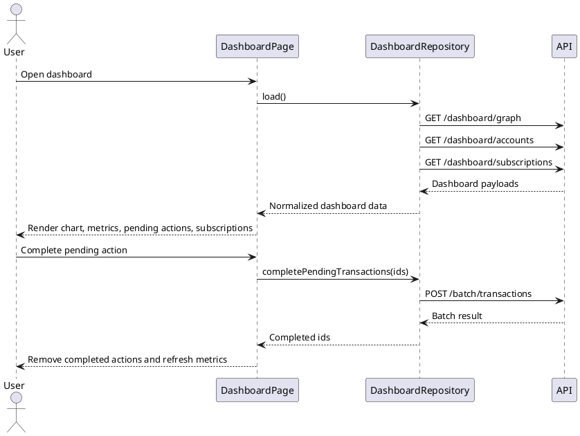

# Dashboard API Requirements

Base URL and authentication follow the existing API client conventions. All endpoints return JSON and require the authenticated user context.

## GET `/dashboard/graph`

Returns the accounts used by the dashboard balance chart.

Response:

```json
{
  "data": [
    {
      "account_id": 33,
      "account_name": "Nomina",
      "balance": -25,
      "color": "#6a4d4d"
    }
  ]
}
```

Fields:

- `account_id`: string or number. Unique account identifier.
- `account_name`: string. Label shown in the chart.
- `balance`: number or numeric string. Current account balance.
- `color`: nullable hex string. Bar accent color.

## GET `/dashboard/accounts`

Returns account summary metrics and the pending actions list.

Response:

```json
{
  "data": {
    "summary": {
      "active_accounts": 3,
      "shared_accounts": 2,
      "pending_total": 1570.5
    },
    "pending_actions": [
      {
        "id": "tx-51",
        "account_id": 33,
        "account_name": "Nomina",
        "account_color": "#6a4d4d",
        "concept": "Egreso pendiente por comprobar",
        "amount": 450.5,
        "date": "2026-06-06"
      }
    ]
  }
}
```

Fields:

- `summary.active_accounts`: number. Count of active accounts visible to the user.
- `summary.shared_accounts`: number. Count of accounts where the user shares ownership or allocation.
- `summary.pending_total`: number or numeric string. Total amount represented by pending actions.
- `pending_actions`: list of transactions/actions that can be completed from the dashboard.
- `pending_actions[].id`: string or number. Transaction/action identifier used by the batch endpoint.
- `pending_actions[].date`: ISO date or datetime string used for ordering.

## POST `/batch/transactions`

Applies one batch action to a list of transactions. The dashboard uses this to complete pending actions.

Request:

```json
{
  "action": "complete",
  "transaction_ids": ["tx-51", "tx-52"]
}
```

Response:

```json
{
  "data": {
    "processed": 2,
    "failed": [],
    "transaction_ids": ["tx-51", "tx-52"]
  }
}
```

Fields:

- `action`: currently only `complete`.
- `transaction_ids`: non-empty list of transaction/action IDs.
- `processed`: number of transactions completed.
- `failed`: optional list of failed items. A failed item should include `id` and `message` when available.
- `transaction_ids`: optional list of completed IDs. When omitted, the frontend assumes all requested IDs succeeded if `failed` is empty.

## GET `/dashboard/subscriptions`

Returns subscription totals for annual spend and recommended savings calculations.

Response:

```json
{
  "data": {
    "annual_total": 27840,
    "subscriptions_count": 3
  }
}
```

Fields:

- `annual_total`: number or numeric string. User annual subscription spend in MXN.
- `subscriptions_count`: number. Count of subscriptions included in the total.

## Dashboard Loading Flow



