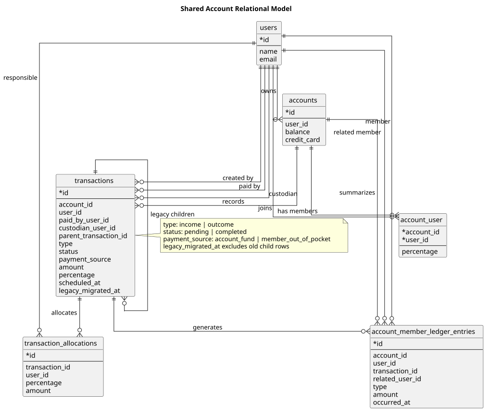
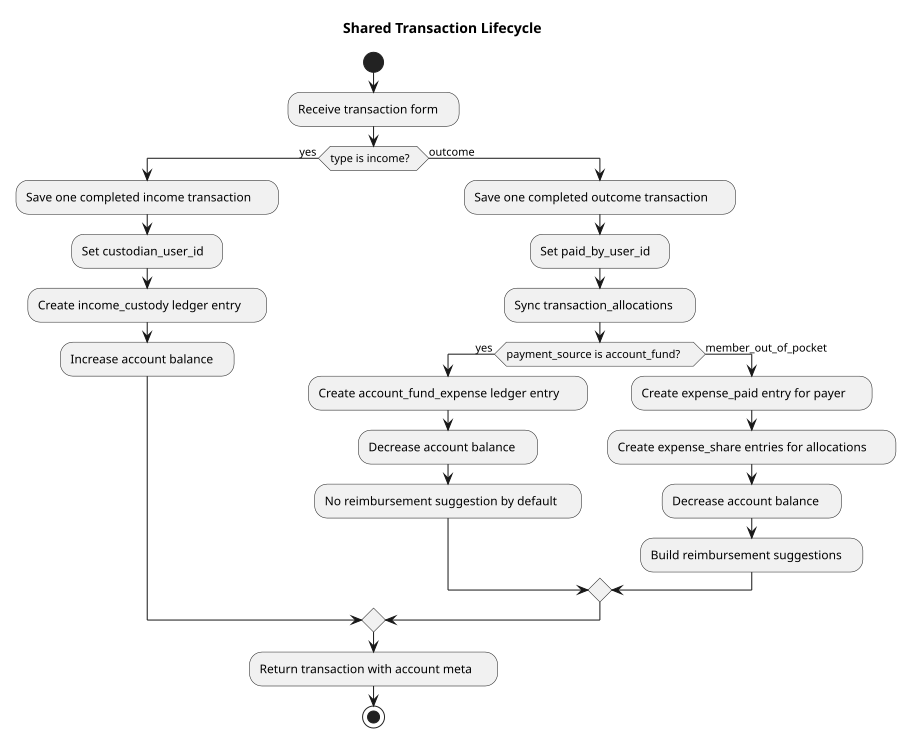
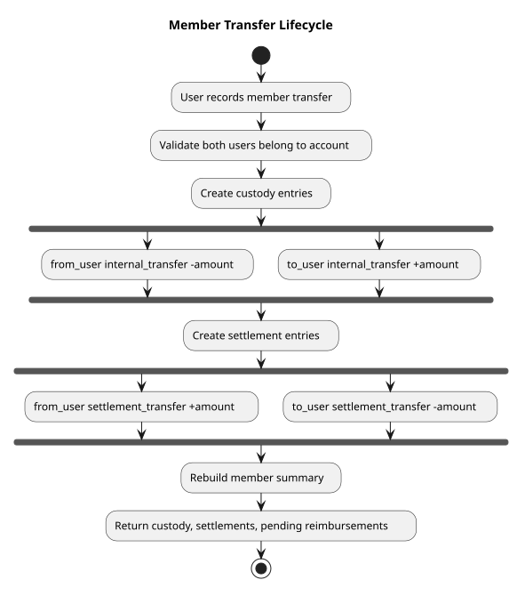
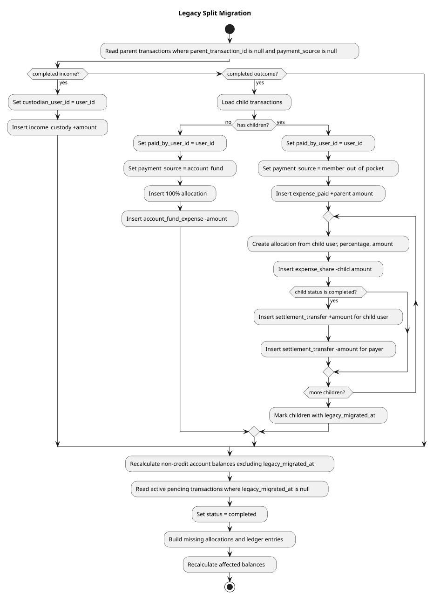

# Shared Account Model

This document explains the hybrid model used for individual accounts, shared current accounts, and payable-style shared accounts.

## Context

The legacy split model created one real expense plus one pending income per participant. That made debts visible, but it mixed three different concepts in `transactions`:

- economic movements that change the account balance,
- member responsibility for a shared expense,
- reimbursements between members.

The new model keeps `transactions` as the economic ledger and moves shared-account responsibility and settlements into explicit tables.

## Diagram Index

These diagrams are kept as editable PlantUML files:

- Relational model: [source](diagrams/shared-account-relations.puml), [rendered SVG](diagrams/shared-account-relations.svg)
- Transaction lifecycle: [source](diagrams/shared-transaction-lifecycle.puml), [rendered SVG](diagrams/shared-transaction-lifecycle.svg)
- Member transfer lifecycle: [source](diagrams/member-transfer-lifecycle.puml), [rendered SVG](diagrams/member-transfer-lifecycle.svg)
- Legacy split migration: [source](diagrams/legacy-split-migration.puml), [rendered SVG](diagrams/legacy-split-migration.svg)

If PlantUML is installed, render them from `api` with:

```bash
plantuml -tsvg docs/diagrams/*.puml
```

## Core Decision

There is no account mode flag for "current" versus "payable". A shared account is always capable of both behaviors:

- an expense can be paid from the account fund,
- an expense can be paid out of pocket by a member,
- an income can be custodied by a member,
- reimbursements are represented as member transfers.

The account `balance` remains the economic balance:

```text
completed incomes - completed outcomes
```

Debts between members do not create income transactions. They are derived from `account_member_ledger_entries`.

## Relational Model

See [shared-account-relations.puml](diagrams/shared-account-relations.puml).



Main entities:

- `transactions`: economic movements. A completed income or outcome affects the account balance.
- `transaction_allocations`: responsibility split for an outcome.
- `account_member_ledger_entries`: member-level ledger used for custody, out-of-pocket payments, shares, and settlements.
- `account_user`: existing account membership and default percentage.

Important transaction fields:

- `paid_by_user_id`: member who paid an outcome.
- `custodian_user_id`: member who holds an income.
- `payment_source`: `account_fund` or `member_out_of_pocket`.
- `legacy_migrated_at`: marks old child transactions that were migrated and should not participate in new lists or balances.
- `status`: kept as a technical field, but active transaction writes must be `completed`.

## Ledger Entry Types

`income_custody`
: Positive custody entry for the member who holds an income.

`account_fund_expense`
: Negative custody entry when an expense is paid from the account fund.

`expense_paid`
: Positive settlement entry for the member who paid an expense out of pocket.

`expense_share`
: Negative settlement entry for each member's responsibility in an out-of-pocket expense.

`internal_transfer`
: Custody movement between members. It is reserved for explicit custody changes and should not be created by reimbursement settlement.

`settlement_transfer`
: Settlement movement that reduces or clears a reimbursement obligation.

`manual_adjustment`
: Explicit custody adjustment.

`legacy_settlement`
: Reserved for compatibility with migrated historical data.

## Transaction Lifecycle

See [shared-transaction-lifecycle.puml](diagrams/shared-transaction-lifecycle.puml).



### Completed Income

Example: account receives `$50,000`, and member A holds the money.

- `transactions`: one `income completed` for `$50,000`.
- `custodian_user_id = A`.
- ledger: `income_custody +50000` for A.
- account balance increases by `$50,000`.

### Completed Expense From Account Fund

Example: account has money in the fund and pays `$1,000`.

- `transactions`: one `outcome completed` for `$1,000`.
- `payment_source = account_fund`.
- `paid_by_user_id` identifies who registered or operated the payment.
- `transaction_allocations` stores responsibility.
- ledger: `account_fund_expense -1000` for the payer/custodian path currently selected.
- account balance decreases by `$1,000`.
- no reimbursement is suggested by default because the fund covered it.

### Completed Expense Paid Out Of Pocket

Example: B pays `$1,000` for a 50/50 shared account with A.

- `transactions`: one `outcome completed` for `$1,000`.
- `payment_source = member_out_of_pocket`.
- `paid_by_user_id = B`.
- allocations:
  - A: `$500`
  - B: `$500`
- ledger:
  - B: `expense_paid +1000`
  - A: `expense_share -500`
  - B: `expense_share -500`
- settlement summary:
  - A: `-500`
  - B: `+500`
- reimbursement suggestion: A pays B `$500`.
- account balance decreases by `$1,000`.

### Transaction Status

`pending` is not an operational transaction state anymore:

- new transaction writes must use `completed`,
- expenses are not planned with transactions,
- financial goals are the planning mechanism,
- member debts are represented by ledger summaries and reimbursements, not pending income rows.

## Member Summary

`BuildAccountMemberSummary` returns:

- `custody_by_user`: who currently holds or lacks account money.
- `settlements_by_user`: who should receive or pay reimbursements.
- `pending_reimbursements`: derived debtor-to-creditor suggestions.

The reimbursement algorithm matches users with negative settlement amounts to users with positive settlement amounts until the open amounts are exhausted.

## Member Transfers

See [member-transfer-lifecycle.puml](diagrams/member-transfer-lifecycle.puml).



When a member pays another member to settle a reimbursement, the app records settlement entries only:

- sender gets `settlement_transfer +amount`,
- receiver gets `settlement_transfer -amount`.

This clears or reduces the debt without changing account custody or creating an economic income transaction. If money custody must move between members, record that as an explicit custody operation instead of piggybacking it on reimbursement settlement.

Endpoint:

```http
POST /api/accounts/{account}/member-transfers
```

Payload:

```json
{
  "from_user_id": 1,
  "to_user_id": 2,
  "amount": 500,
  "description": "Trip reimbursement",
  "occurred_at": "2026-07-19T12:00:00Z"
}
```

## Legacy Migration

See [legacy-split-migration.puml](diagrams/legacy-split-migration.puml).



Data migration:

[2026_07_19_132817_migrate_legacy_split_transactions_to_member_ledger.php](../database/migrations/2026_07_19_132817_migrate_legacy_split_transactions_to_member_ledger.php)

Pending close-out migration:

[2026_07_19_165913_complete_active_pending_transactions.php](../database/migrations/2026_07_19_165913_complete_active_pending_transactions.php)

Migration rules:

- completed legacy incomes become income custody entries,
- completed simple outcomes become account-fund expenses with one 100% allocation,
- legacy split outcomes become out-of-pocket expenses,
- legacy child transactions become allocations and settlement entries,
- completed legacy child transactions also generate `settlement_transfer` entries,
- migrated child transactions are marked with `legacy_migrated_at`,
- standard account balances are recalculated excluding migrated legacy children.

This prevents old child income transactions from appearing as real income in the new balance and transaction lists.

The pending close-out migration converts active `pending` transactions to `completed`, builds missing allocations/ledger entries, and recalculates affected account balances. Child transactions already marked with `legacy_migrated_at` stay excluded.

## Query Rules

New operational queries must exclude migrated child transactions:

```php
whereNull('legacy_migrated_at')
```

This is used for balance recalculation, account transaction lists, and transaction facility queries.

## Implementation Map

- `TransactionCreator`: writes one economic transaction, then syncs allocations and member ledger.
- `TransactionUpdater`: updates the economic transaction, then resyncs allocations and member ledger.
- `TransactionRemover`: deletes allocations and ledger entries with the transaction.
- `SyncTransactionAllocations`: owns allocation persistence.
- `SyncAccountMemberLedger`: owns ledger regeneration for a transaction.
- `BuildAccountMemberSummary`: derives custody, settlement, and reimbursements.
- `RegisterAccountMemberTransfer`: records reimbursement settlement between members.

## Current Trade-Offs

- Completed out-of-pocket expenses immediately produce reimbursement suggestions.
- Account-fund expenses do not automatically infer which custodian should be reimbursed unless the payment source is captured as out-of-pocket.
- Reimbursement settlement does not change custody or account balance.
- Historical pending transaction data is normalized to completed data by migration.
- `legacy_migrated_at` is the safety marker that prevents double-counting migrated children.
